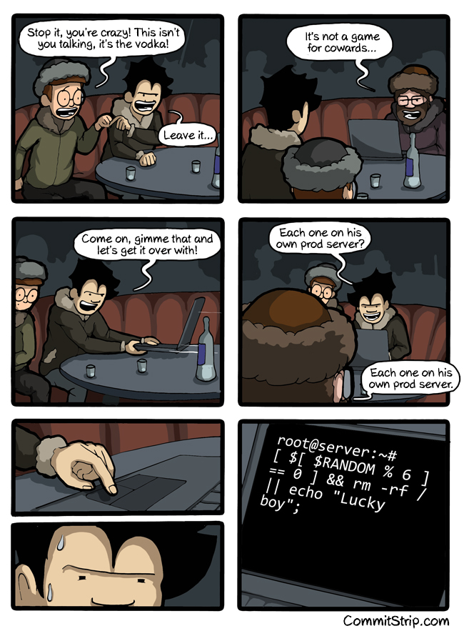

# Russian Server Roulette
## CAUTION!
> **It can delete everything on your server/computer! Playing on your own risk!**

## How does the Game work
It works like the classic Russian Roulette but instead of pointing with a gun to your brain, you'll point with that gun to your server.

One in six times it will execute the command ```sudo rm -rf /* --no-preserve-root``` and delete everything on your server. When this happens you've lost and your server is dead.

## How to Play
Sit down with your friends, take a bottle of vodka and each of you execute the bash script on their machine. The game is recommended for one to six players.
**Do not copy paste this command into your command prompt if you don't understand what it does. Executing this bash script is on your own risk!**

```shell
curl -s https://raw.githubusercontent.com/faessler/russian-server-roulette/master/revolver.bash | bash
```

## Credits
This project was inspired by this little comic:



_Source: http://www.commitstrip.com/en/2014/05/16/russian-roulette/_
